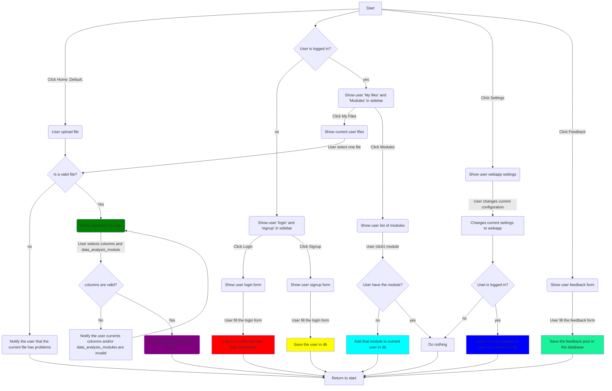
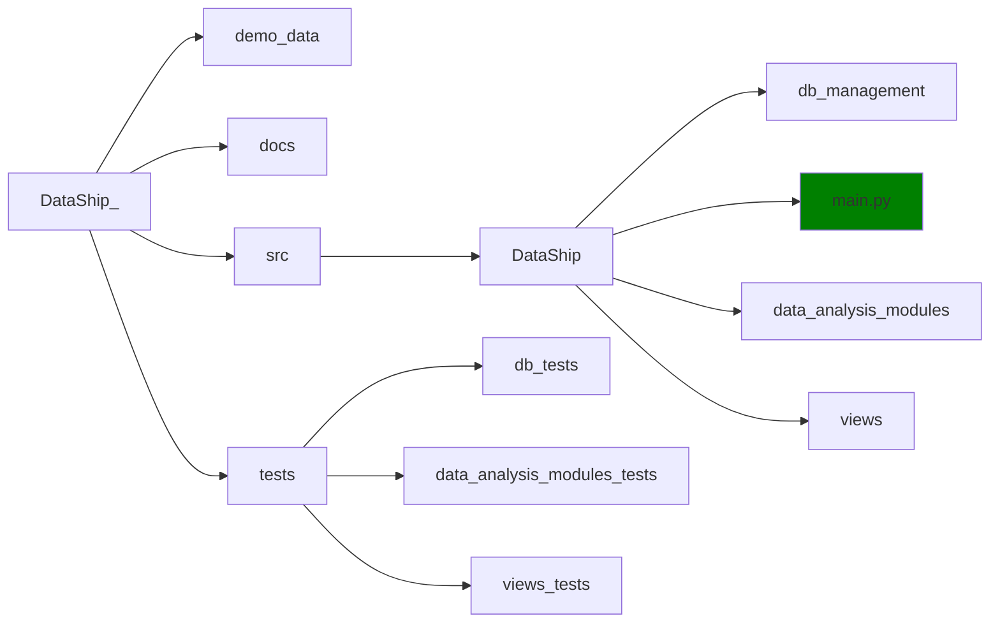

# DataShip
[](https://github.com/AgustinZavalaA/DataShip/actions/workflows/tests.yml) [](http://104.248.205.64:8501/)

Datatship is an easy to use, open source, and free data analysis platform. It is a web application that allows users to upload data files, and then perform data analysis on them.

Performing the following analysis:
- **Data Visualization (Multiple charts types and modes)**
- **Statistical Analysis (Mean, Median, Mode, Standard Deviation, Variance)**
- **Machine Learning (Linear Regression, K-Means)**


## Data Flow Diagram
Data inside DataShip follow the next diagram, if you expierence something not showed here open an issue in the [github repository](https://github.com/AgustinZavalaA/DataShip) 

<style>
    .mermaid svg { height: auto; }
</style>

The next tables show in more details the flow of the data in the colored boxes.
###  <span style="color:purple">Modules</span>
| Module name        | Module description | Input | Output method |
| ------------------ | ------------------ | ----- | ------------- |
| Mean               | The mean is the average of a data set.                | 1 or more numeric values   | Sum of Observation ÷ Total numbers of Observations          |
| Median             | The mode is the most common number in a data set                | 1 or more numeric values   | sort the values and return the value in the index {Total numbers of Observations//2}        |
| Mode               | The median is the middle of the set of numbers.                | 1 or more numeric values   | return the most repeated value in the sequence           |
| Standard Deviation | The standard deviation is a statistic that measures the dispersion of a dataset relative to its mean                | 1 or more numeric values   | the square root of the sum of squared differences from the mean divided by the size of the data set           |
| Variance           | variance is the expectation of the squared deviation of a random variable from its population mean or sample mean.                | 1 or more numeric values   | take the standard deviation and multiply by itself           |
| Linear Regression  | a linear model is a model that assumes a linear relationship between the input variables (x) and the single output variable (y).                | 2 or 3 columns, one representing a class value and the other must be numeric columns  | Y= a + bX           |
| Clusterization     | k-means clustering is a method of vector quantization, originally from signal processing, that aims to partition n observations into k clusters  | 2 or 3 columns, one representing a class value and the other must be numeric columns |  Compute the sum of the squared distance between data points and all centroids           |
| Graphing           | A diagram showing the relationship of quantities |  2 or 3 columns, one representing a class value and the other must be numeric columns |  Depending on the selected graph type it could be different           |


## Project File Structure
The final project structure should look something like this:


## Requirements
- [Python 3.9](https://www.python.org/ "Python latest version")

## Installation
1. After installing python, download the current version of this repository, you can do it with the following command or download the zip archive and extract it:
``` bash
git clone https://github.com/AgustinZavalaA/DataShip.git
```
2. Open a terminal and navigate to the DataShip folder:
``` bash
cd DataShip
```
3. Create a virtual environment and activate it:
```bash
mkdir venv
python3 -m venv venv/ds_venv
```
If you are using Windows, you can use the following command:
```pwsh
venv/ds_venv/Scripts/activate
```
If you are using a POSIX system (Linux, MACOS), you can use the following command:
```bash
source venv/ds_venv/bin/activate
```
4. Run the following command to install DataShip as a package and install all the dependencies:
``` bash
pip install -e .
```
5. If you don't have a database, you can create one with the following command:
``` bash
python src/DataShip/db_management/db_manager.py -cps
```
where the parameters are:
- `-c`: create the database
- `-p`: populate the database with demo data
- `-s`: show the database
   
6. Run the following command to run the DataShip application:
``` bash
python -m streamlit run src/DataShip/main.py
```
or if you want to run the application in debug mode:
``` bash
python -m streamlit run src/DataShip/main.py --debug
```

## Development
1. If you want to run the tests, you must first install the dependencies:
``` bash
pip install -r requirements_dev.txt
```
2. Run the following command to run the tests with tox:
``` bash
tox
```