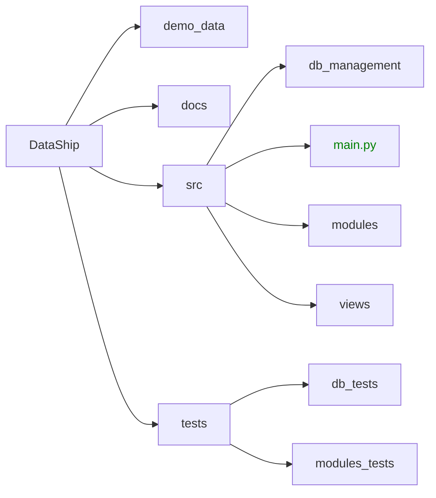

# TODO
- checar aggrid streamlit para reemplazar el dataframe de pandas
- checar el siguiente link para mejoras generales [tutorial](https://medium.com/@avra42/streamlit-python-cool-tricks-to-make-your-web-application-look-better-8abfc3763a5b)
- Investigar como hacer unit testing al menos en los modulos de data analysis
- Ir quitando los archivos de la carpeta functionality_tests, debido a que no son partes integradas al proyeto, son solo ejemplos.
- Separar codigo en carpetas
  

# Requirements
- [Python](https://www.python.org/ "Python latest version")

# Installation

``` bash
$ git clone https://github.com/AgustinZavalaA/DataShip
$ cd DataShip
$ pip install -r requirements.txt
$ python -m streamlit run src/main.py
```


# Project File Structure
The final project structure should look something like this:
