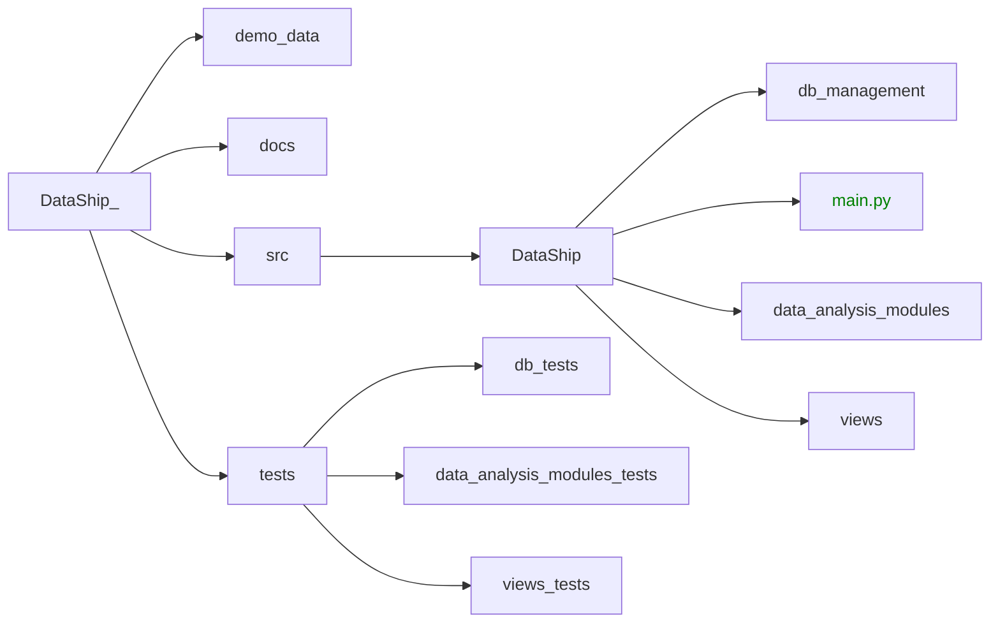

# TODO
- checar aggrid streamlit para reemplazar el dataframe de pandas
- checar el siguiente link para mejoras generales [tutorial](https://medium.com/@avra42/streamlit-python-cool-tricks-to-make-your-web-application-look-better-8abfc3763a5b)
- Investigar como hacer unit testing al menos en los modulos de data analysis
- Ir quitando los archivos de la carpeta functionality_tests, debido a que no son partes integradas al proyeto, son solo ejemplos.
- Separar codigo en carpetas
  
# Project File Structure
The final project structure should look something like this:


# Requirements
- [Python](https://www.python.org/ "Python latest version")

# Installation
1. After installing python, download the current version of this repository, you can do it with the following command or download the zip archive and extract it:
``` bash
git clone https://github.com/AgustinZavalaA/DataShip.git
```
2. Open a terminal and navigate to the DataShip folder:
``` bash
cd DataShip
```
3. Run the following command to install all the dependencies:
``` bash
pip install -r requirements.txt
```
3.1. If you don't have a database, you can create one with the following command:
``` bash
python src/db_management/create_db.py -cps
```
where the parameters are:
- `-c`: create the database
- `-p`: populate the database with demo data
- `-s`: show the database
   
1. Run the following command to run the DataShip application:
``` bash
python -m streamlit run src/DataShip/main.py
```
or if you want to run the application in debug mode:
``` bash
python -m streamlit run src/DataShip/main.py --debug
```